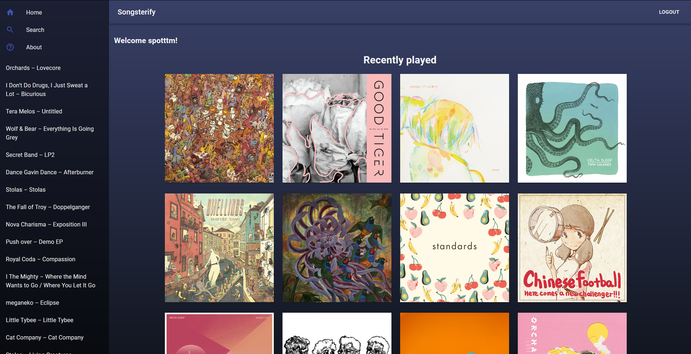

# [Songsterify](https://songsterify.com/)

Songsterify combines Songsterr and Spotify to make it easy to find new songs to play!

Browse your favourite playlists / albums and discover tabs that you did not know exist.

🎵🎸🎶

## Development

### ./.env

| KEY           | VALUE                                                                              | Required |
| ------------- | ---------------------------------------------------------------------------------- | -------- |
| PORT          | 3003                                                                               | Yes      |
| CLIENT_ID     | You can get this value from Spotify Dashboard                                      | Yes      |
| CLIENT_SECRET | You can get this value from Spotify Dashboard                                      | Yes      |
| CALLBACK      | It must point to client /callback/, you also need to set this in Spotify Dashboard | Yes      |

### ./client/.env.development

| KEY                    | VALUE                                   | Required |
| ---------------------- | --------------------------------------- | -------- |
| REACT_APP_DEV_CALLBACK | Same as above, and in Spotify Dashboard | Yes      |

### Installing dependencies

From root `npm install` then `cd client` and `npm install`.

### Running development mode

From root `npm run start` then `cd client` and `npm run start`

Development client should start in port 3000, and server in port 3003.

### Building

From root `cd client` then `npm run build`. You can view the built app with `npm run start` from root.

## Tests

### ./cypress.env.json

| KEY          | VALUE                                              | Required |
| ------------ | -------------------------------------------------- | -------- |
| refreshToken | You can get this from your cookie after logging in | Yes      |

### Running tests

Without coverage and with servers running you can `npx cypress open`.

If you want coverage, you need to run servers with different commands.

From root `npm run start:coverage` then again in root `npm run start-ci`.

Now if you run tests with `npx cypress open`, there will be coverage report in ./coverage/ , which you can open with browser. Alternatively you can run `npm run report:coverage:text`
